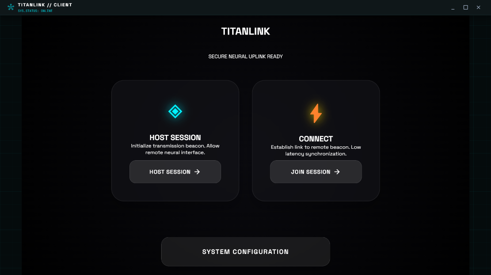

# TitanLink

Ultra low-latency peer-to-peer gaming client for Windows. Play games together with friends remotely, as if they were sitting right next to you.



## Features

- **Sub-frame latency** - Optimized for gaming with minimal delay
- **Direct P2P connection** - No game servers required, direct peer-to-peer streaming
- **Full controller support** - Native Xbox controller emulation via ViGEmBus
- **Easy to use** - Simple host/connect flow with 6-character session codes
- **Optimized video** - Hardware-accelerated screen capture and encoding

## Requirements

### Host PC
- Windows 10/11 (64-bit)
- Modern GPU (for hardware encoding)
- ViGEmBus driver (for controller emulation)
- Good upload bandwidth (10+ Mbps recommended)

### Client PC
- Windows 10/11 (64-bit)
- Xbox controller or compatible gamepad
- Good download bandwidth

## Installation

### From Release
1. Download the latest installer from [Releases](https://github.com/your-repo/titanlink/releases)
2. Run `TitanLink Setup.exe`
3. Follow the installation wizard

### From Source
```bash
# Clone the repository
git clone https://github.com/your-repo/titanlink.git
cd titanlink

# Install dependencies
npm install

# Run in development mode
npm run electron:dev

# Build for production
npm run electron:build
```

## Usage

### As Host
1. Launch TitanLink
2. Click "Host a Game"
3. Select the display you want to share
4. Share the 6-character session code with your friend
5. Wait for them to connect
6. Start your game!

### As Client
1. Launch TitanLink
2. Click "Connect to Friend"
3. Enter the session code from your friend
4. Connect your controller
5. Play!

## Architecture

```
┌─────────────────────────────────────────────────────────────────┐
│                        HOST PC                                   │
│  ┌─────────────────┐    ┌─────────────────┐    ┌─────────────┐  │
│  │  Screen Capture │───▶│  Video Encoder  │───▶│   WebRTC    │──┼──┐
│  │ (desktopCapturer)│    │  (H.264/VP9)    │    │ Video Track │  │  │
│  └─────────────────┘    └─────────────────┘    └─────────────┘  │  │
│                                                                  │  │
│  ┌─────────────────┐    ┌─────────────────┐                     │  │
│  │ Virtual Xbox    │◀───│  Input Decoder  │◀────────────────────┼──┤
│  │ Controller      │    │  (Binary)       │    DataChannel      │  │
│  │ (ViGEmBus)      │    └─────────────────┘    (Unreliable)     │  │
│  └─────────────────┘                                             │  │
└─────────────────────────────────────────────────────────────────┘  │
                                                                      │
                         ┌─────────────────────┐                     │
                         │  Signaling Server   │                     │
                         │   (Socket.IO)       │◀─────────────────────┤
                         └─────────────────────┘                     │
                                                                      │
┌─────────────────────────────────────────────────────────────────┐  │
│                        CLIENT PC                                 │  │
│  ┌─────────────────┐    ┌─────────────────┐    ┌─────────────┐  │  │
│  │  Video Display  │◀───│  Video Decoder  │◀───│   WebRTC    │◀─┼──┘
│  │  (HTML5 Video)  │    │  (Hardware)     │    │ Video Track │  │
│  └─────────────────┘    └─────────────────┘    └─────────────┘  │
│                                                                  │
│  ┌─────────────────┐    ┌─────────────────┐                     │
│  │ Physical Xbox   │───▶│  Input Encoder  │─────────────────────┼───▶
│  │ Controller      │    │  (Binary 24B)   │    DataChannel      │
│  │ (Gamepad API)   │    └─────────────────┘    (Unreliable)     │
│  └─────────────────┘                                             │
└─────────────────────────────────────────────────────────────────┘
```

## Tech Stack

- **Frontend**: React + TypeScript + Vite
- **Desktop**: Electron
- **Networking**: WebRTC (with unreliable DataChannels for input)
- **Controller**: ViGEmBus + node-vigemclient
- **Signaling**: Socket.IO

## Latency Optimizations

1. **Unreliable DataChannels** - Controller inputs use `maxRetransmits: 0` for UDP-like behavior
2. **Binary Protocol** - 24-byte compact binary format for controller state
3. **Hardware Capture** - Uses Electron's `desktopCapturer` for GPU-accelerated capture
4. **Input Timestamping** - Old inputs are dropped to prevent input queue buildup
5. **No Buffering** - Video player configured for minimum latency

## Project Structure

```
titanlink/
├── electron/                 # Electron main process
│   ├── main.ts              # Main entry point
│   ├── preload.ts           # Secure IPC bridge
│   └── services/            # Backend services
│       ├── DriverManager.ts
│       ├── VirtualControllerService.ts
│       ├── WebRTCHostService.ts
│       └── WebRTCClientService.ts
├── src/                     # React renderer
│   ├── components/          # Reusable UI components
│   ├── pages/               # Page components
│   └── App.tsx              # Main React app
├── shared/                  # Shared types
│   └── types/
│       └── ipc.ts           # IPC & binary protocol types
├── signaling-server/        # WebRTC signaling server
└── resources/               # Bundled resources
```

## Signaling Server

The signaling server is required for the initial WebRTC handshake. You can:

1. **Use the built-in server** - Run locally during development
2. **Deploy to Glitch/Railway** - Free hosting options
3. **Self-host** - Run on your own server

See `signaling-server/README.md` for deployment instructions.

## Contributing

1. Fork the repository
2. Create a feature branch
3. Make your changes
4. Submit a pull request

## License

MIT License - see [LICENSE](LICENSE) for details.

## Acknowledgments

- [ViGEm](https://vigem.org/) - Virtual gamepad emulation framework
- [Electron](https://electronjs.org/) - Cross-platform desktop framework
- [WebRTC](https://webrtc.org/) - Real-time communication technology
