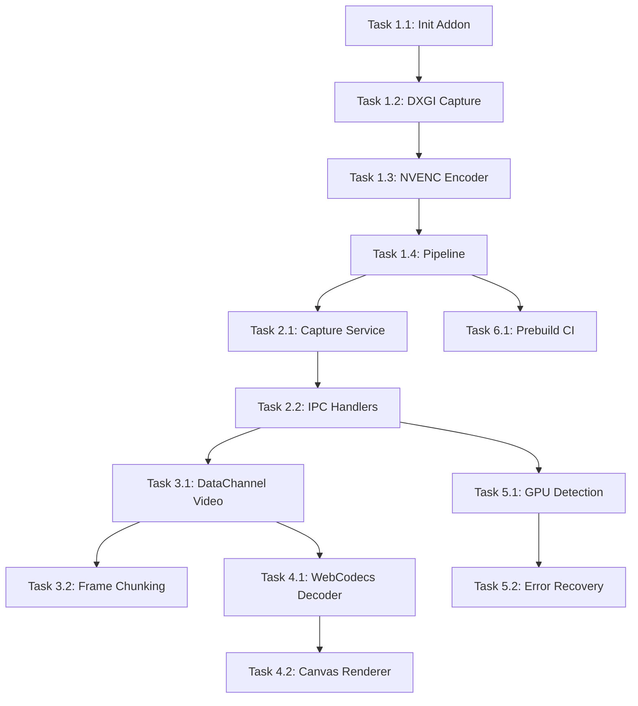

# Hardware Capture Pipeline - Ultra-Low Latency Streaming

## 🎯 Overview

**Goal:** Replace Chrome's `getDisplayMedia()` + WebRTC encoder with a native hardware accelerated pipeline to achieve **sub-20ms end-to-end latency** (Parsec-level performance).

**Current Architecture (Slow):**
```
Screen → getDisplayMedia() (~15-20ms) → Chrome VP8/H264 encoder (~20-30ms) → WebRTC → Network → Decode → Display
                                                                             ≈ 70-150ms total
```

**Target Architecture (Fast):**
```
Screen → DXGI Capture (~1-2ms) → NVENC H264 (~3-5ms) → DataChannel → Network → WebCodecs Decode (~3-5ms) → Canvas
                                                                                    ≈ 15-25ms total
```

## 📊 Project Type

**Type:** BACKEND (Native Addon + Electron Integration)

**Primary Agent:** `backend-specialist`

**Required Skills:**
- Node.js Native Addons (Node-API / NAPI-RS)
- Windows DXGI Desktop Duplication API
- NVIDIA Video Codec SDK (NVENC)
- WebCodecs API (Client-side decoding)

---

## ✅ Success Criteria

| Metric | Current | Target |
|--------|---------|--------|
| Capture Latency | ~15-20ms | <2ms |
| Encode Latency | ~20-30ms | <5ms |
| End-to-End Latency | ~100ms+ | <25ms |
| CPU Usage | ~30-50% | <10% |
| GPU Encode Load | N/A | NVENC dedicated |

**Measurable Goals:**
1. ✅ DXGI capture callback fires within 2ms of frame ready
2. ✅ NVENC encodes frame within 5ms
3. ✅ DataChannel receives H264 NAL unit
4. ✅ WebCodecs decodes and renders within 5ms
5. ✅ Total glass-to-glass latency < 25ms (excluding network RTT)

---

## 🔧 Tech Stack

| Component | Technology | Rationale |
|-----------|------------|-----------|
| **Capture API** | DXGI Desktop Duplication | Fastest Windows capture, GPU-resident frames |
| **Encoder** | NVENC (NVIDIA Video Codec SDK) | Hardware encoder, 1-5ms latency, zero-copy possible |
| **Native Addon** | NAPI-RS (Rust) or Node-API (C++) | Bridge native code to Node.js/Electron |
| **Transport** | WebRTC DataChannel | Already working, unreliable UDP semantics |
| **Client Decoder** | WebCodecs VideoDecoder | Hardware-accelerated H264 decode in browser |
| **Rendering** | Canvas 2D / OffscreenCanvas | Direct frame drawing, no <video> element |

### Alternative Encoder Options

| GPU Vendor | Encoder | Supported? |
|------------|---------|------------|
| NVIDIA | NVENC | ✅ Primary target |
| AMD | AMF | 🔄 Future support |
| Intel | QuickSync | 🔄 Future support |
| Fallback | x264 (Software) | ✅ CPU fallback |

---

## 📁 File Structure

```
titanlink/
├── native/                          # NEW: Native addon source
│   ├── Cargo.toml                   # Rust project config (if using NAPI-RS)
│   ├── src/
│   │   ├── lib.rs                   # Main native addon
│   │   ├── capture/
│   │   │   ├── mod.rs
│   │   │   ├── dxgi.rs              # DXGI Desktop Duplication
│   │   │   └── frame.rs             # Frame buffer management
│   │   ├── encoder/
│   │   │   ├── mod.rs
│   │   │   ├── nvenc.rs             # NVENC H264 encoder
│   │   │   ├── amf.rs               # AMD AMF (future)
│   │   │   └── software.rs          # x264 fallback
│   │   └── pipeline.rs              # Capture → Encode pipeline
│   ├── binding.gyp                  # If using node-gyp (C++ route)
│   └── build.rs                     # Rust build script
│
├── electron/
│   ├── services/
│   │   └── HardwareCaptureService.ts  # NEW: Native addon bridge
│   └── main.ts                      # IPC handlers for native capture
│
├── src/
│   └── services/
│       ├── WebRTCService.ts         # MODIFIED: Use DataChannel for video
│       └── WebCodecsDecoder.ts      # NEW: Hardware-accelerated decoder
│
├── prebuilds/                       # Prebuilt native binaries
│   └── win32-x64/
│       └── titanlink-capture.node
│
└── package.json                     # Add native build scripts
```

---

## 📋 Task Breakdown

### Phase 1: Foundation - Native Addon Setup

#### Task 1.1: Initialize Native Addon Project
- **Agent:** `backend-specialist`
- **Skill:** `nodejs-best-practices`
- **Priority:** P0 (Blocker)
- **Dependencies:** None
- **Estimated Time:** 2 hours

**INPUT:** Empty `native/` directory
**OUTPUT:** Working NAPI-RS or Node-API project that exports a test function
**VERIFY:** 
```bash
npm run build:native
node -e "console.log(require('./native').test())"
# → Outputs "Hello from Rust/C++"
```

**Implementation Notes:**
- Choose NAPI-RS (Rust) for memory safety and easier Windows API bindings
- Or use Node-API (C++) if team is more comfortable with C++
- Set up prebuild workflow for CI/CD

---

#### Task 1.2: DXGI Desktop Duplication Capture
- **Agent:** `backend-specialist`
- **Skill:** `nodejs-best-practices`
- **Priority:** P0 (Blocker)
- **Dependencies:** Task 1.1
- **Estimated Time:** 4-6 hours

**INPUT:** Native addon project
**OUTPUT:** Function that captures a single frame as GPU texture
**VERIFY:**
```javascript
const { captureFrame } = require('./native');
const frame = captureFrame(displayIndex);
console.log(frame.width, frame.height, frame.format); // 1920 1080 BGRA
```

**Implementation Notes:**
```rust
// Pseudo-code for DXGI capture
unsafe {
    let output = dxgi_factory.enum_outputs(display_index)?;
    let duplication = output.duplicate_output(&device)?;
    
    loop {
        let (frame_info, resource) = duplication.acquire_next_frame(16)?; // 16ms timeout
        if frame_info.AccumulatedFrames > 0 {
            // Got new frame as ID3D11Texture2D
            let texture = resource.query_interface::<ID3D11Texture2D>()?;
            // Keep texture on GPU for zero-copy encode
            return texture;
        }
    }
}
```

**Key Considerations:**
- Handle `DXGI_ERROR_ACCESS_LOST` when switching displays/modes
- Support multiple monitors
- Keep frame on GPU (don't copy to CPU unless fallback)

---

#### Task 1.3: NVENC H264 Encoder Integration
- **Agent:** `backend-specialist`
- **Skill:** `nodejs-best-practices`
- **Priority:** P0 (Blocker)
- **Dependencies:** Task 1.2
- **Estimated Time:** 6-8 hours

**INPUT:** GPU texture from DXGI capture
**OUTPUT:** Encoded H264 NAL units as Buffer
**VERIFY:**
```javascript
const { captureAndEncode } = require('./native');
const nalUnits = captureAndEncode(displayIndex); // Returns Uint8Array[]
console.log(nalUnits.length); // Multiple NAL units
// Can save to file and verify with ffprobe
```

**Implementation Notes:**
```rust
// NVENC low-latency preset configuration
let encoder_config = NV_ENC_CONFIG {
    preset: NV_ENC_PRESET_LOW_LATENCY_HP,
    profile: NV_ENC_H264_PROFILE_BASELINE, // No B-frames
    rate_control: NV_ENC_PARAMS_RC_CBR_LOWDELAY_HQ,
    gop_length: 60, // Keyframe every 60 frames
    b_frames: 0,    // CRITICAL: No B-frames for low latency
    ..Default::default()
};
```

**Key Settings for Low Latency:**
| Setting | Value | Reason |
|---------|-------|--------|
| Preset | `LOW_LATENCY_HP` | Minimize encode time |
| Profile | `BASELINE` | No B-frames, simple decode |
| RC Mode | `CBR_LOWDELAY_HQ` | Stable bitrate, minimal buffering |
| B-frames | 0 | Removes reorder latency |
| Lookahead | 0 | No buffering future frames |
| Intra Refresh | Enabled | Gradual keyframes |

---

#### Task 1.4: Create Continuous Capture Pipeline
- **Agent:** `backend-specialist`
- **Skill:** `nodejs-best-practices`
- **Priority:** P1
- **Dependencies:** Task 1.3
- **Estimated Time:** 3-4 hours

**INPUT:** Capture + encode functions
**OUTPUT:** Continuous pipeline that fires callback with encoded frames
**VERIFY:**
```javascript
const { startCapture, stopCapture } = require('./native');

startCapture(displayIndex, { fps: 60, bitrate: 10_000_000 }, (frame) => {
    console.log(`Frame ${frame.timestamp}: ${frame.data.length} bytes`);
});

setTimeout(() => stopCapture(), 5000);
```

**Implementation Notes:**
- Run capture loop in separate thread
- Use ring buffer for frame queue
- Fire callback to JS via `napi_call_threadsafe_function`

---

### Phase 2: Electron Integration

#### Task 2.1: Create HardwareCaptureService
- **Agent:** `backend-specialist`
- **Skill:** `nodejs-best-practices`
- **Priority:** P1
- **Dependencies:** Phase 1 complete
- **Estimated Time:** 3 hours

**INPUT:** Native addon with capture functions
**OUTPUT:** TypeScript service wrapping native addon with proper types
**VERIFY:**
```typescript
import { HardwareCaptureService } from './services/HardwareCaptureService';

const capture = new HardwareCaptureService();
capture.on('frame', (frame) => console.log(frame.length));
capture.start({ displayIndex: 0, fps: 60 });
```

**Files:**
- `electron/services/HardwareCaptureService.ts`
- `shared/types/capture.ts` (TypeScript interfaces)

---

#### Task 2.2: Add IPC Handlers for Hardware Capture
- **Agent:** `backend-specialist`
- **Skill:** `nodejs-best-practices`
- **Priority:** P1
- **Dependencies:** Task 2.1
- **Estimated Time:** 2 hours

**INPUT:** HardwareCaptureService
**OUTPUT:** IPC channels for renderer to control capture
**VERIFY:**
```typescript
// In renderer process
const supported = await window.electronAPI.hardwareCapture.isSupported();
// → { nvenc: true, amd: false, intel: false }
```

**IPC Channels:**
- `hardware-capture:is-supported` → Check GPU encoder availability
- `hardware-capture:start` → Start capture with settings
- `hardware-capture:stop` → Stop capture
- `hardware-capture:get-displays` → List available displays

---

### Phase 3: WebRTC DataChannel Video Transport

#### Task 3.1: Modify WebRTCService for Binary Video Frames
- **Agent:** `backend-specialist`
- **Skill:** `nodejs-best-practices`
- **Priority:** P1
- **Dependencies:** Task 2.2
- **Estimated Time:** 4 hours

**INPUT:** Existing WebRTCService.ts
**OUTPUT:** New DataChannel for video frames (separate from input channel)
**VERIFY:**
- Host sends encoded H264 NAL units over DataChannel
- Client receives and logs frame sizes

**Implementation Notes:**
```typescript
// Create video channel (in addition to input channel)
private videoChannel: RTCDataChannel | null = null;

private createVideoChannel(): void {
    this.videoChannel = this.peerConnection.createDataChannel('video', {
        ordered: true,         // Frames must arrive in order
        maxRetransmits: 0,     // Don't retry lost frames
        negotiated: true,
        id: 1,                 // Different from input channel (id: 0)
    });
}
```

**Frame Header Protocol:**
```
[4 bytes] Frame number (uint32)
[8 bytes] Timestamp (uint64, μs)
[1 byte]  Keyframe flag
[1 byte]  Number of NAL units
[N bytes] NAL unit data (Annex B format)
```

---

#### Task 3.2: Implement Frame Chunking for Large Frames
- **Agent:** `backend-specialist`
- **Priority:** P2
- **Dependencies:** Task 3.1
- **Estimated Time:** 2 hours

**INPUT:** Large encoded H264 frames (potentially > 256KB)
**OUTPUT:** Chunking protocol for DataChannel (max message size varies by browser)

**Chunking Protocol:**
```
[2 bytes] Chunk index (0 = start, N = continuation)
[2 bytes] Total chunks
[4 bytes] Frame ID
[N bytes] Chunk data
```

---

### Phase 4: Client-Side WebCodecs Decoding

#### Task 4.1: Create WebCodecsDecoder Service
- **Agent:** `backend-specialist`
- **Skill:** `nodejs-best-practices`
- **Priority:** P1
- **Dependencies:** Task 3.1
- **Estimated Time:** 4 hours

**INPUT:** DataChannel receiving H264 NAL units
**OUTPUT:** Decoded VideoFrame rendered to canvas
**VERIFY:**
- Smooth video playback on client
- Latency counter shows decode time < 5ms

**Files:**
- `src/services/WebCodecsDecoder.ts`

**Implementation:**
```typescript
class WebCodecsDecoder {
    private decoder: VideoDecoder;
    private canvas: OffscreenCanvas | HTMLCanvasElement;
    
    async init() {
        this.decoder = new VideoDecoder({
            output: (frame) => this.renderFrame(frame),
            error: (e) => console.error('Decode error:', e),
        });
        
        this.decoder.configure({
            codec: 'avc1.42E01F', // H.264 Baseline Profile Level 3.1
            hardwareAcceleration: 'prefer-hardware',
            optimizeForLatency: true,  // CRITICAL for low latency
        });
    }
    
    decode(nalData: Uint8Array, isKeyframe: boolean) {
        const chunk = new EncodedVideoChunk({
            type: isKeyframe ? 'key' : 'delta',
            timestamp: performance.now() * 1000, // μs
            data: nalData,
        });
        this.decoder.decode(chunk);
    }
    
    private renderFrame(frame: VideoFrame) {
        this.canvas.getContext('2d').drawImage(frame, 0, 0);
        frame.close();
    }
}
```

---

#### Task 4.2: Replace Video Element with Canvas Renderer
- **Agent:** `frontend-specialist`
- **Priority:** P2
- **Dependencies:** Task 4.1
- **Estimated Time:** 2 hours

**INPUT:** StreamView.tsx using `<video>` element
**OUTPUT:** Use `<canvas>` with WebCodecs rendering
**VERIFY:**
- Video displays smoothly
- No `<video>` element jitter buffer delay

---

### Phase 5: Fallback & Error Handling

#### Task 5.1: GPU Detection and Fallback
- **Agent:** `backend-specialist`
- **Priority:** P2
- **Dependencies:** Phase 2
- **Estimated Time:** 2 hours

**INPUT:** Native addon
**OUTPUT:** Automatic fallback to WebRTC when no hardware encoder available
**VERIFY:**
```typescript
if (!await hardwareCapture.isSupported().nvenc) {
    console.log('NVENC not available, falling back to WebRTC');
    // Use existing getDisplayMedia path
}
```

---

#### Task 5.2: Error Recovery for Capture Failures
- **Agent:** `backend-specialist`
- **Priority:** P2
- **Dependencies:** Task 5.1
- **Estimated Time:** 2 hours

**INPUT:** DXGI errors (ACCESS_LOST, etc.)
**OUTPUT:** Automatic reconnection on display mode changes
**VERIFY:**
- Switching resolution doesn't crash
- Fullscreen games work

---

### Phase 6: Build & Distribution

#### Task 6.1: Setup Prebuild Workflow
- **Agent:** `devops-engineer`
- **Priority:** P2  
- **Dependencies:** Phase 1 complete
- **Estimated Time:** 3 hours

**INPUT:** Native addon source
**OUTPUT:** CI workflow that builds native binaries for Windows x64
**VERIFY:**
- GitHub Actions builds `.node` binary
- Published to npm or embedded in release

---

## 📊 Dependency Graph



---

## ⏱️ Timeline Estimate

| Phase | Tasks | Time Estimate |
|-------|-------|---------------|
| Phase 1 | Native Addon | 15-20 hours |
| Phase 2 | Electron Integration | 5-6 hours |
| Phase 3 | DataChannel Transport | 6-8 hours |
| Phase 4 | WebCodecs Decoder | 6-8 hours |
| Phase 5 | Fallback & Error | 4-5 hours |
| Phase 6 | Build & CI | 3-4 hours |
| **Total** | | **40-50 hours** |

---

## ⚠️ Risks & Mitigations

| Risk | Impact | Mitigation |
|------|--------|------------|
| NVIDIA driver issues | High | Test on multiple driver versions, implement software fallback |
| WebCodecs browser support | Medium | Electron bundles Chromium with full support |
| Native addon build complexity | Medium | Use prebuild binaries, avoid runtime compilation |
| Memory leaks in native code | High | Rust's ownership model, extensive testing |
| Frame synchronization | Medium | Timestamp-based sync, drop late frames |

---

## 🏁 Phase X: Verification

### Pre-flight Checks
- [ ] `npm run build:native` succeeds
- [ ] All unit tests pass
- [ ] No lint errors

### Latency Verification
```bash
# Run latency measurement tool (to be created)
npm run test:latency

# Expected output:
# Capture: 1.2ms avg
# Encode: 4.1ms avg
# Network: [varies]
# Decode: 3.8ms avg
# Total pipeline: 9.1ms avg (excluding network)
```

### Functional Tests
- [ ] Host can start hardware capture
- [ ] Client receives and decodes video
- [ ] Fallback to WebRTC works when no GPU encoder
- [ ] Controller input still works (separate DataChannel)
- [ ] Audio streaming unaffected

### Quality Verification
```bash
python .agent/skills/vulnerability-scanner/scripts/security_scan.py .
python .agent/skills/lint-and-validate/scripts/lint_runner.py .
```

---

## 📚 References

- [DXGI Desktop Duplication](https://learn.microsoft.com/en-us/windows/win32/direct3ddxgi/desktop-dup-api)
- [NVIDIA Video Codec SDK](https://developer.nvidia.com/video-codec-sdk)
- [Node-API Documentation](https://nodejs.org/api/n-api.html)
- [NAPI-RS (Rust bindings)](https://napi.rs/)
- [WebCodecs API](https://developer.mozilla.org/en-US/docs/Web/API/WebCodecs_API)
- [WebCodecs Low Latency](https://developer.chrome.com/docs/media/webcodecs/)

---

## ✅ PHASE X COMPLETE
- [ ] All tasks verified
- [ ] Latency target achieved
- [ ] Security scan passed
- [ ] Documentation complete
